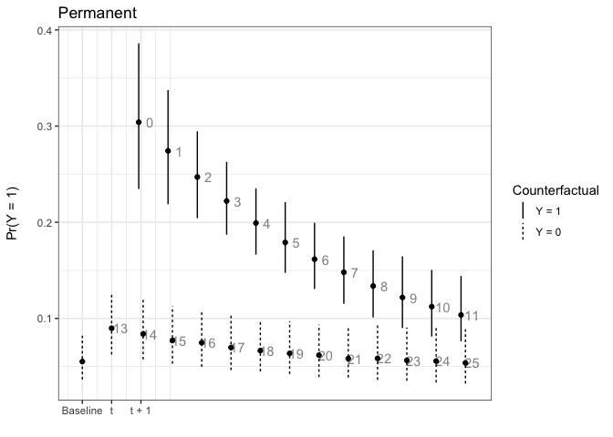
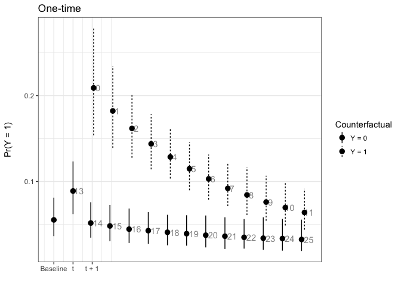
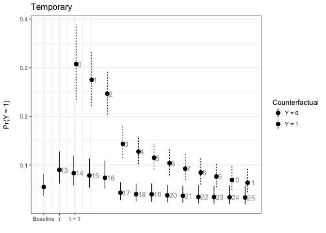
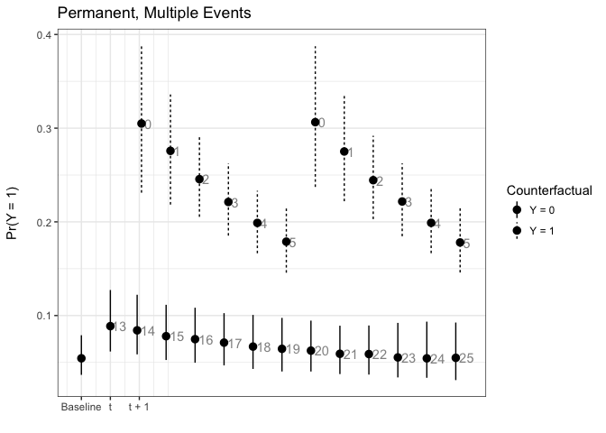
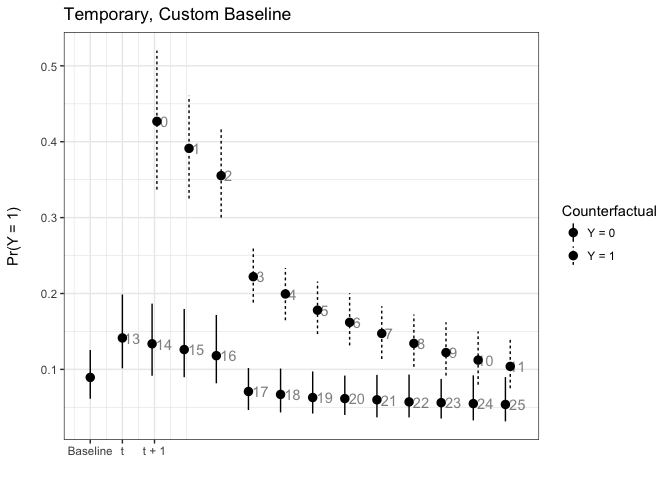

<!-- README.md is generated from README.Rmd. Please edit that file -->

> R package to simulate **P**robabilistic **L**ong-**T**erm **E**ffects
> in models with temporal dependence

Christopher Gandrud and Laron K. Williams

Version: 0.1.1 

About
=====

**pltesim** implements [Williams's
(2016)](http://pan.oxfordjournals.org/content/24/2/243) method for
simulating probabilistic long-term effects in models with temporal
dependence.

It is built on the
[coreSim](https://github.com/christophergandrud/coreSim) package.

Process
=======

To find and show probabilistic long-term effects in models with temporal
dependence with **pltesim**:

1.  Estimate the coefficients. Currently **pltesim** works with binary
    outcome models, e.g. logit, so use `glm` from the default
    R installation.

2.  Create a data frame with your counterfactual. This should have a row
    with the fitted counterfactual values and columns with names
    matching those in your fitted model. All variables without values
    will be treated as 0 in the counterfactual.

3.  Simulate the long-term effects with `plte_builder`.

4.  Plot the results with `plte_plot`.

Examples
========

These examples replicate Figure 1 in [Williams
(2016)](http://pan.oxfordjournals.org/content/24/2/243). First estimate
your model. You may need to use `btscs` to generate spells for the
binary dependent variable.

    library(pltesim)
    library(ggplot2)

    data('negative')

    # BTSCS set the data
    neg_set <- btscs(df = negative, event = 'y', t_var = 'tim',
                     cs_unit = 'group', pad_ts = FALSE)

    # Create temporal dependence variables
    neg_set$t <- neg_set$spell + 1

    m1 <- glm(y ~ x + t + I(t^2) + I(t^3),
              family = binomial(link = 'logit'),
              data = neg_set)

Then fit the counterfactual:

    counterfactual <- data.frame(x = 0.5)

Now simulate and plot long-term effects for a variety of scenarios using
`plte_builder` and `plte_plot`. `plte_builder` takes as its input the
fitted model object with the estimated coefficients (`obj`), an
identification of the basic time period variable (`obj_tvar`), the
counterfactual (`cf`), how long the counterfactual persists
(`cf_duration`, it is `permanent` by default), and the time period
points over which to simulate the effects.

Note that by default the predicted probabilities from logistic
regression models are found. You can specify a custom quantity of
interest function with the `FUN` argument.

In this first example the counterfactual is persistent throughout the
entire time span:

    # Permanent
    sim1 <- plte_builder(obj = m1, obj_tvar = 't',
                         cf = counterfactual, t_points = c(13, 25))

    plte_plot(sim1) + ggtitle('Permanent')

Note that the numbers next to each simulation point indicate the time
since the last event. You can choose to not show these numbers by
setting `t_labels = FALSE` in the `plte_plot` call.

In the next example, the effect only lasts for one time period:

    # One-time
    sim2 <- plte_builder(obj = m1, obj_tvar = 't', cf_duration = 'one-time',
                         cf = counterfactual, t_points = c(13, 25))

    plte_plot(sim2) + ggtitle('One-time')

We can also have the counterfactual effect last for short periods of
time and simulate the effect if another event occurs:

    # Temporary
    sim3 <- plte_builder(obj = m1, obj_tvar = 't', cf_duration = 4,
                         cf = counterfactual, t_points = c(13, 25))

    plte_plot(sim3) + ggtitle('Temporary')

    # Multiple events, permanent counter factual
    sim4 <- plte_builder(obj = m1, obj_tvar = 't',
                         cf = counterfactual, t_points = c(13, 20, 25))

    plte_plot(sim4) + ggtitle('Permanent, Multiple Events')

By default the baseline scenario has all covariate values fitted at 0.
You can supply a custom baseline scenario in the second row of the
counterfactual (`cf`) data frame. For example:

    # Custom baseline scenario
    counterfactual_baseline <- data.frame(x = c(1, 0.5))

    sim5 <- plte_builder(obj = m1, obj_tvar = 't', cf_duration = 4,
                         cf = counterfactual_baseline, t_points = c(13, 25))

    plte_plot(sim5) + ggtitle('Temporary, Custom Baseline')

Install
=======

To install the development version of `pltesim` use:

    devtools::install_github('christophergandrud/pltesim')
